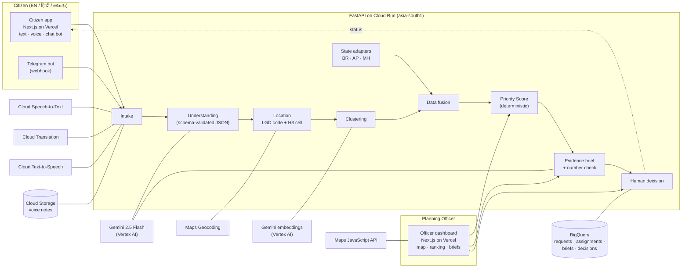

# JanVaani: Multilingual Citizen Development Request Platform

**JanVaani lets any citizen ask for what their village or ward needs (by voice, text or chat, in
Hindi, Telugu or English) and turns thousands of these requests into ranked, evidence-backed
infrastructure recommendations for planning officers.** Gemini understands each request, it is
mapped to an LGD-style location and grouped with similar requests, fused with demographic,
infrastructure-gap and investment data, scored transparently, and written up as a grounded evidence
brief. An officer approves the recommendation, and the citizen sees the new status in their own language.

Build with AI (Google) hackathon, Track 1. Full spec: [docs/PRD.md](docs/PRD.md) ·
Submission pack: [docs/SUBMISSION.md](docs/SUBMISSION.md) · Pitch deck: [PPTX](docs/pitch/JanVaani_Spontom_Pitch.pptx) · [PDF](docs/pitch/JanVaani_Spontom_Pitch.pdf) (`cd docs/pitch && npm install && node build-deck.js`)

## Live URLs

| Component | URL |
|---|---|
| Citizen app (Vercel) | *to be filled by lead* |
| Planning Officer dashboard (Vercel) | *to be filled by lead* |
| API (Cloud Run, asia-south1) | https://civic-demand-network-api-847963771142.asia-south1.run.app ([OpenAPI docs](https://civic-demand-network-api-847963771142.asia-south1.run.app/docs), [integration status](https://civic-demand-network-api-847963771142.asia-south1.run.app/api/system/status)) |
| Source | https://github.com/ipavanreddy/civic-demand-network |

## Architecture



- **One API, domain modules.** `services/api/app/pipeline/` holds intake, understanding, location,
  clustering, fusion, scoring and brief; `services/*/README.md` describe the service boundaries they
  can be split along.
- **Observed data → AI interpretation → recommendation** stay separate. Gemini only reads structured
  context and must return JSON that validates against a schema (`ai/schemas/`, versioned prompts in
  `ai/prompts/`). Numbers it adds that the citizen did not say are removed; every number in a brief
  is checked against the input data.
- **The score is not AI.** `services/api/app/pipeline/scoring.py` is a deterministic, weighted
  formula whose factor breakdown is shown to the officer.
- **Every AI record** stores `model_name`, `model_version`, `prompt_version`; every data value has a
  source and a reference year.

## Google AI integration map

| Google technology | Where | What it does in JanVaani | Live in production |
|---|---|---|---|
| Gemini 2.5 Flash on Vertex AI | `app/ai/gemini.py`, `pipeline/understanding.py`, `pipeline/brief.py` | Structured request extraction (category, sub-category, location mentions, urgency, vulnerable groups, confidence, missing info, clarification question); evidence briefs from structured data only; fallback for transcription / translation | Yes (service account, location `global`) |
| Gemini embeddings (`gemini-embedding-001`) | `pipeline/clustering.py` | Semantic similarity for joining a request to a demand cluster | Yes |
| Cloud Speech-to-Text | `integrations/google_speech.py` | Hindi / Telugu / English voice notes → text (auto language among the three) | Yes |
| Cloud Translation | `integrations/google_speech.py` | Original text kept, English copy used for analysis | Yes |
| Cloud Text-to-Speech | `integrations/google_speech.py` | Spoken confirmation in the citizen's language | Yes |
| Google Maps Geocoding API | `integrations/maps.py` | Place names not in the local gazetteer | Yes |
| Google Maps JavaScript API | `apps/officer-dashboard/src/components/map-google.tsx` | Hotspot map (H3 hexagons + cluster circles) | Yes, when the browser key allows the Vercel domain (else Leaflet fallback, labelled) |
| BigQuery | `integrations/bigquery_sink.py`, `infrastructure/bigquery/schema.sql` | Streams requests, cluster assignments, briefs, weight changes and decisions for analytics | Yes (dataset `civic_demand_network`) |
| Cloud Storage | `integrations/media.py` | Voice notes | Yes (`gs://spontom-build-with-ai-media/requests/`) |
| Cloud Run, Cloud Build, Artifact Registry, Secret Manager | `infrastructure/cloud-run/` | API hosting, image build, API keys | Yes |
| Firebase | – | Citizen auth / realtime status (planned) | No (not provisioned yet) |

## Run locally

Prerequisites: Node 20.9+ with pnpm, Python 3.12 with [uv](https://docs.astral.sh/uv/).

```bash
pnpm install
(cd services/api && uv sync)
for a in apps/*; do [ -f $a/.env.local ] || cp $a/.env.example $a/.env.local; done
[ -f .env ] || cp .env.example .env       # keys optional; empty = demo mode

pnpm dev:api                 # http://localhost:8010  (OpenAPI docs at /docs)
pnpm dev:citizen-web         # http://localhost:3010  Citizen app (EN / हिन्दी / తెలుగు)
pnpm dev:officer-dashboard   # http://localhost:3011  Planning Officer dashboard
```

Checks: `pnpm test:api` (pytest, always in demo mode), `pnpm lint`, `pnpm build`.
Live Gemini evaluation (uses your `.env`): `cd services/api && uv run python -m app.eval_extraction 40`.

API container (same image as Cloud Run; build context is the repo root):

```bash
docker build -f services/api/Dockerfile -t civic-demand-network-api .
docker run --rm -p 8080:8080 civic-demand-network-api     # demo mode without env vars
```

## Environment variables

API: repo-root `.env` (copy `.env.example`). Frontends: `apps/<app>/.env.local` locally, Vercel
project settings in production. Nothing secret is committed; on Cloud Run keys come from Secret Manager.

| Variable | Used by | Purpose | Empty / unset |
|---|---|---|---|
| `GOOGLE_GENAI_USE_VERTEXAI` | API | `true` = Gemini through Vertex AI with the service account | Uses `GEMINI_API_KEY` |
| `GOOGLE_CLOUD_PROJECT` | API | GCP project for Vertex AI and BigQuery | Gemini (Vertex) and BigQuery off |
| `GOOGLE_CLOUD_LOCATION` | API | Vertex AI location for Gemini (`global`; `asia-south1` returned 429s) | `global` |
| `GOOGLE_APPLICATION_CREDENTIALS` | API (local only) | Service-account JSON path; exported for the Google client libraries | Application Default Credentials |
| `GEMINI_API_KEY` | API | Gemini API key (alternative to Vertex AI) | – |
| `GEMINI_MODEL` / `GEMINI_EMBEDDING_MODEL` | API | Model IDs, never hard-coded (`gemini-2.5-flash`, `gemini-embedding-001`) | Defaults shown |
| `GEMINI_THINKING_BUDGET` | API | `0` = no thinking tokens (2–5 s per call instead of 10–25 s); `-1` = dynamic | `0` |
| `GOOGLE_CLOUD_API_KEY` | API | Cloud Speech-to-Text, Translation, Text-to-Speech (REST). **Not** `GOOGLE_API_KEY`: google-genai would treat that as a Gemini key and bypass Vertex AI | Gemini or demo fallbacks |
| `MAPS_API_KEY` | API | Geocoding for unmatched place names | Local gazetteer only |
| `USE_BIGQUERY` + `BIGQUERY_DATASET` | API | Stream records to BigQuery (`civic_demand_network`) | In-memory + local JSON |
| `GCS_BUCKET` | API | Voice-note storage | `services/api/.data/media/` |
| `TELEGRAM_BOT_TOKEN` | API | Deliver Telegram replies, download voice notes | Replies returned in the HTTP response (chat tab) |
| `CORS_ORIGINS` / `CORS_ORIGIN_REGEX` | API | Allowed frontend origins; the regex admits Vercel previews (`https://.*\.vercel\.app`) | localhost:3010/3011 |
| `CITIZEN_ID_SALT` | API | Salt for pseudonymous citizen IDs (hashed phone / chat IDs) | Demo salt |
| `LOCAL_STATE_PATH` | API | Local JSON file for runtime state (empty in the container) | In-memory only |
| `NEXT_PUBLIC_API_URL` | both apps | API base URL (build time) | `http://localhost:8010` |
| `NEXT_PUBLIC_MAPS_API_KEY` | officer dashboard | Maps JavaScript API browser key (HTTP-referrer restricted) | Leaflet + OpenStreetMap |

## Demo mode and live mode

Every integration sits behind one adapter and falls back to a clearly labelled demo path when its
key is missing **or when a live call fails**, so the journey never breaks:

| Integration | Live | Fallback |
|---|---|---|
| Gemini extraction | Gemini 2.5 Flash | Hand-authored fixtures (`ai/evaluation/fixtures/`) → keyword rule extractor |
| Evidence brief | Gemini from structured input + number check | Template brief (same number check) |
| Clustering similarity | Gemini embeddings | Bag-of-words cosine |
| Speech-to-Text / Translation | Cloud APIs | Gemini, then sample transcript / fixture translation |
| Text-to-Speech | Cloud TTS (MP3) | Browser speech synthesis |
| Geocoding | Google Geocoding | Local gazetteer (exact / fuzzy / pin) |
| BigQuery / Cloud Storage | Streaming inserts / GCS | In-memory store + local disk |
| Telegram | Bot API delivery | Reply shown in the response / chat tab |

The header badge in both apps reads *Live AI · n/m integrations · sample data* and opens a
per-integration list: **live**, **demo** (not configured) or **fallback** (configured, but the most
recent call failed, with the error). Every AI output shows its `model_name`
(e.g. `gemini-2.5-flash`, or `demo-fixture` / `demo-rule-extractor` / `demo-template`).
All data is synthetic sample data and is labelled as such in the data files, API and UI.
`POST /api/system/reset` drops runtime changes (new requests, decisions, weight changes).

## Demo walkthrough (PRD §44)

1. **Citizen app → हिन्दी → Demo scenarios "A · BR · हिन्दी"** (or *बोलें* to record a voice note). Send.
   Transcript, English translation, extracted category / urgency / vulnerable groups / confidence,
   location resolved to a sample LGD code + H3 cell, and a Hindi confirmation (▶ plays Cloud TTS audio).
2. **Confirm**: the request joins the Sonbarsa bridge cluster (request count, unique citizens,
   representative quotes). **"A-clarify"** shows the ambiguous *Rampur* clarification question.
   The **Chat bot** tab runs the same flow through the Telegram webhook.
3. **Officer dashboard** → India → Bihar → Gaya: hotspot map, KPIs, data freshness, ranked
   recommendations with factor bars.
4. **Policy lens**: raise *Vulnerability* → *Apply & re-rank*: rank-change arrows, and the change is logged.
5. **Generate evidence brief**: demand evidence, cited data evidence, investments, uncertainties, next
   step, plus the *number check*. Then a **human decision**; *Check status* in the citizen app now
   shows *अनुशंसित* (Recommended).
6. **Interoperability tab**: Bihar ↔ Andhra Pradesh ↔ Maharashtra raw records → adapter config → the
   same canonical schema. Scenario **B** (Telugu, drinking water) and **C** (English, Pune transport)
   run through the identical pipeline.

The timed video script is in [docs/SUBMISSION.md](docs/SUBMISSION.md).

## Priority Score

`100 × (wD·Demand + wG·Gap + wV·Vulnerability + wT·Trend − wI·Investment) / (wD+wG+wV+wT)`, defaults
30/30/20/10/10. Demand = recency-weighted *unique* citizens per 10k population (repeat submissions do
not inflate it), normalised to the top cluster in scope; Trend = last 30 days vs the 30 before;
Gap / Vulnerability / Investment coverage are population-weighted 0–1 shares. A missing gap indicator
uses a neutral 0.5 and is flagged in the breakdown and the brief. Every weight change is logged
(and streamed to BigQuery).

## Onboarding a new state

A state is **configuration, not code**. `data/adapters/{BR,AP,MH}.json` map three differently shaped
state files into the canonical schema (`data/schemas/*.json`):

| State | Raw shape | Unit | Focus |
|---|---|---|---|
| Bihar | Hindi-transliterated CSV columns, scheme list (*yojana suchi*) | Village | Bridges / roads |
| Andhra Pradesh | Nested JSON, SC and ST in separate columns (adapter sums them), households | Habitation | Drinking water |
| Maharashtra | Urban ward CSV with slum share, municipal capex list | Ward | Public transport |

To add a state (PRD §40): (1) add `data/adapters/<XX>.json` with names, languages, unit level, map
centre and channels; (2) point `units`, `indicators` and `investments` at the state's files and map
their columns (dot paths for JSON, `sum` / `int` / `float` transforms, value maps); (3) give every
indicator a source and a year; (4) run `pnpm test:api` (`tests/test_adapters.py` validates every
adapter against the canonical schema); (5) restart the API: the state appears in both apps, the
Interoperability tab and all APIs. Taxonomy, prompts, scoring and briefs are shared and unchanged.
The same pattern ports across borders (e.g. other BRICS countries): swap LGD codes for the national
admin-unit registry and add the language to the speech / translation config.

## Data

`python3 data/transformations/generate_sample.py` regenerates all synthetic sample data
deterministically (fixed seed, no AI). `data/sample/manifest.json` lists source / reference year /
version / scope / synthetic flag per file. JSON Schemas: `cd services/api && uv run python -m app.export_schemas`.
Sources the sample is modelled on are listed in [THIRD_PARTY.md](THIRD_PARTY.md).

## Deployment

- **API → Cloud Run**: `CORS_ORIGINS=... infrastructure/cloud-run/deploy.sh api` (Cloud Build from the
  repo root, service account `hackathon-dev@…`, Vertex AI Gemini, keys from Secret Manager).
- **Frontends → Vercel**: one project per `apps/<app>` directory; see
  [infrastructure/vercel/README.md](infrastructure/vercel/README.md).
- **BigQuery tables**: `infrastructure/bigquery/schema.sql`.

## Known gaps

- Firebase auth, officer RBAC and WhatsApp are not implemented (Firebase is not provisioned); the two
  roles are separate apps without login.
- The in-memory store is the serving layer (Cloud Run runs one instance; state resets on restart);
  BigQuery is a write-only analytics sink, no BigQuery vector search yet.
- Telegram needs a bot token; until then the chat tab shows the bot's replies in the browser.
- Photo upload, impact view and demand forecasting (PRD Priority 4) are not built.
- All figures are synthetic; LGD codes are sample codes.

## Layout

| Path | Purpose |
|---|---|
| `apps/citizen-web/` | Citizen app (Vercel) |
| `apps/officer-dashboard/` | Planning Officer dashboard (Vercel) |
| `services/api/` | FastAPI: `app/pipeline/`, `app/routers/`, `app/interop/` (state adapters), `app/integrations/` (Google / Telegram adapters) |
| `services/{intake,understanding,location,clustering-scoring,evidence-brief,localization,messaging-bot}/` | Service boundaries (implemented as modules of the API for the MVP) |
| `ai/` | Prompts, JSON schemas, taxonomy, evaluation fixtures |
| `data/` | Canonical schema, state adapters, synthetic sample data, generator |
| `infrastructure/` | Cloud Run deploy, Vercel settings, BigQuery schema |
| `docs/` | PRD, submission pack, pitch deck (`docs/pitch/`, generated by `build-deck.js`) |
